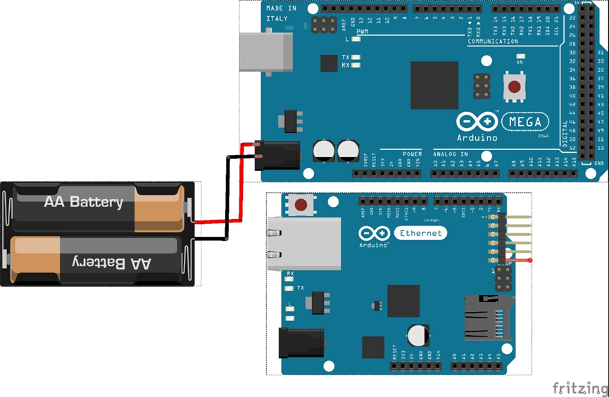
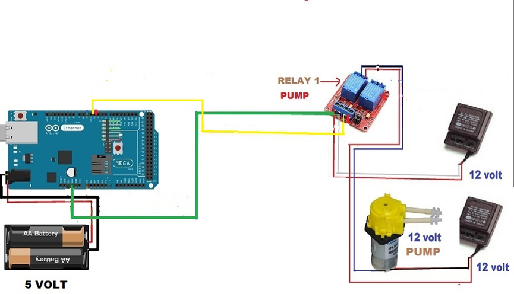
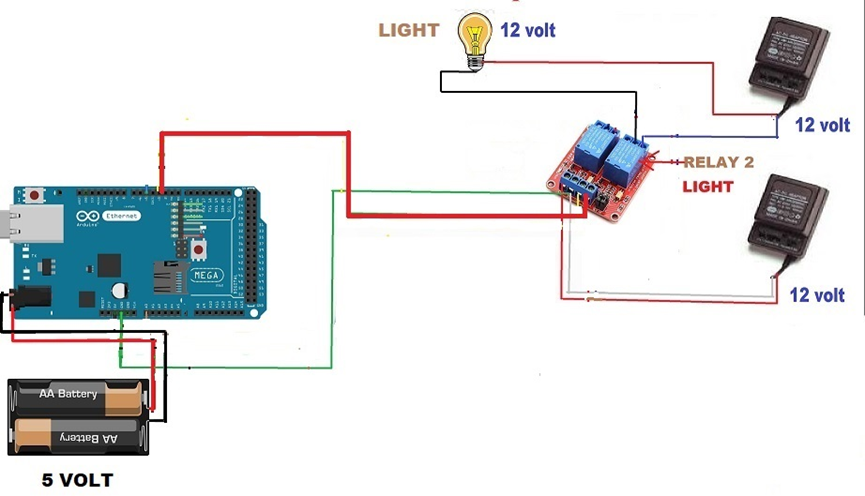
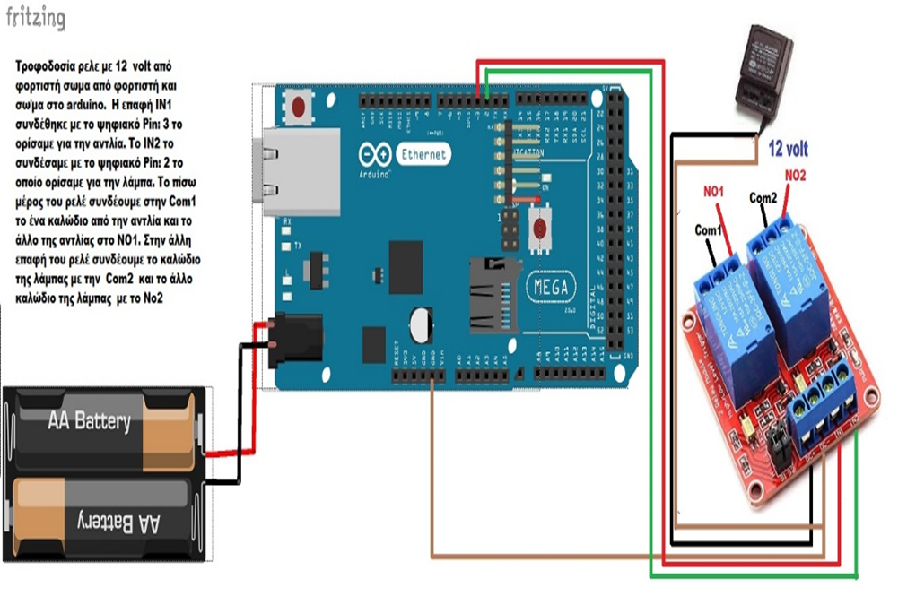
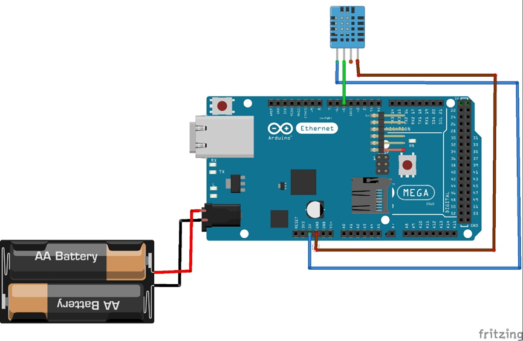
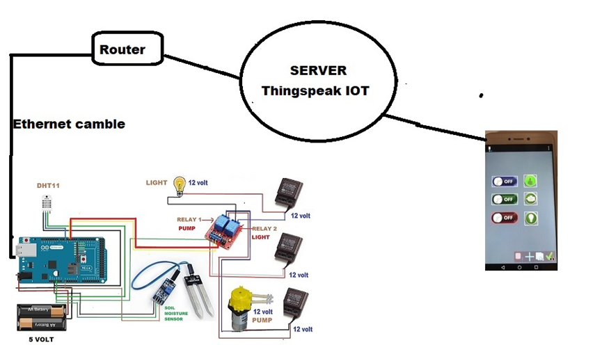
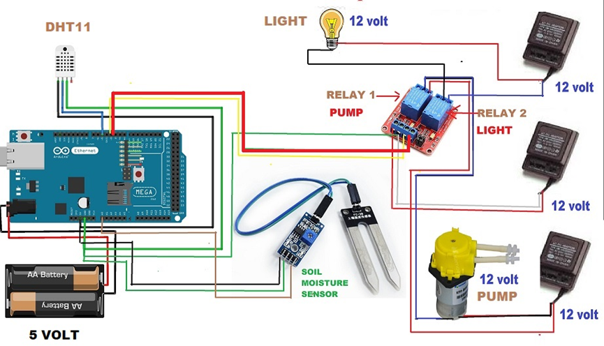

# Automatic Watering System with Arduino Mega

## Overview

This project implements an automatic watering system using an Arduino Mega 2560 combined with an Ethernet Shield W5100. It utilizes two channels on a ThingSpeak server, enabling commands to be sent and data to be received via a mobile application called Virtuino. The system controls a pump (solenoid valve) and a lamp, monitoring soil moisture and ambient temperature and humidity with appropriate sensors. It also allows manual operation of the pump and lamp.

## Components

- Arduino Mega 2560
- Ethernet Shield W5100
- Soil Moisture Sensor
- DHT11 Temperature and Humidity Sensor
- Solenoid Valve (Pump)
- 12V LED Lamp
- 12V 2-Channel Relay for High/Low Trigger

## Setup

1. **Arduino and Ethernet Shield Configuration**: Connect the Ethernet Shield W5100 to the Arduino Mega. Use an Ethernet cable to connect the shield to your network.
2. **Sensor Calibration**: Calibrate the soil moisture sensor by determining the dry and wet soil values.
3. **ThingSpeak Configuration**: Create two channels on ThingSpeak; one for sensors (temperature, humidity, soil moisture) and another for commands (pump and lamp control).
4. **Virtuino Mobile App Setup**: Download Virtuino mobile app and configure it to send commands to the ThingSpeak Commands channel.

## Usage

1. **Monitoring**: The system automatically reads data from the sensors and updates the ThingSpeak Sensors channel.
2. **Control**: Use the Virtuino app to manually control the pump and lamp by sending commands to the ThingSpeak Commands channel.
3. **Automatic Watering**: The system decides whether to activate the pump based on soil moisture readings.

## Programming

The Arduino Mega 2560 is programmed to:
- Read data from the DHT11 and soil moisture sensors.
- Send sensor data to the ThingSpeak Sensors channel.
- Read commands from the ThingSpeak Commands channel.
- Control the pump and lamp based on sensor data and received commands.

Refer to the provided sketches for detailed implementation.

## Ethernet Shield W5100

## Pump

## Led

## Relay

## DHT11 Sensor

## Final

